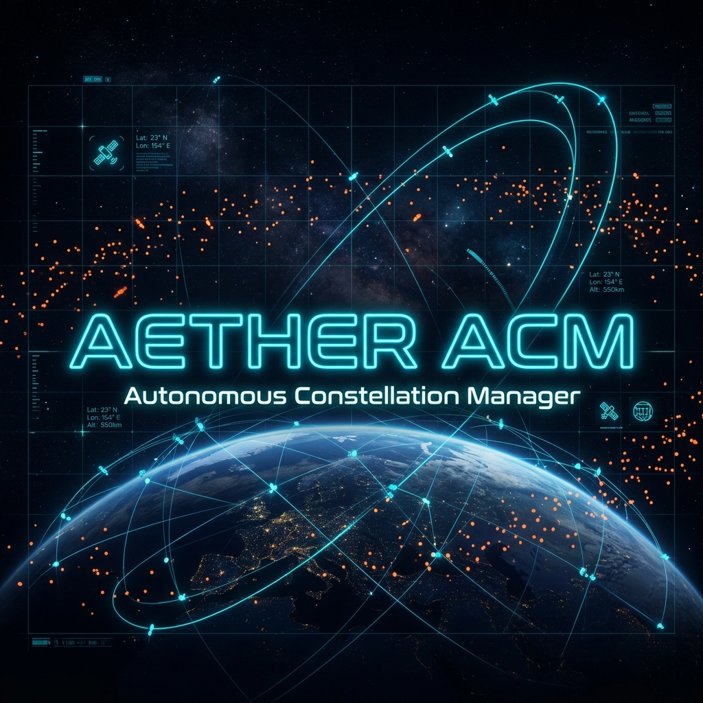
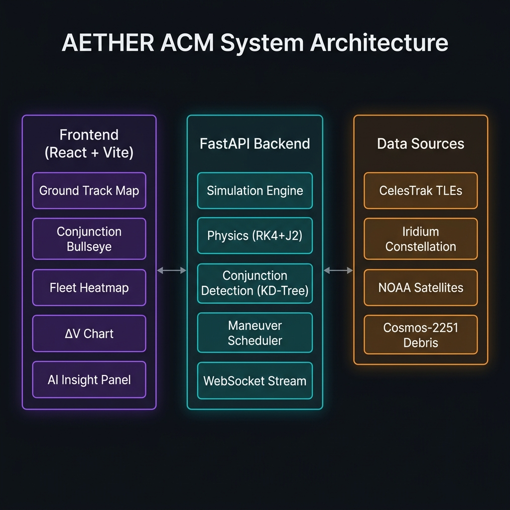

<div align="center">



# AETHER — Autonomous Constellation Manager

**Real-time orbital simulation platform with AI-driven collision avoidance**

[](https://frontend-silk-one-18fssednq0.vercel.app)
[](https://aether-acm-backend.onrender.com/docs)
[](https://github.com/Divyav19/nasaIITD)

[](https://fastapi.tiangolo.com)
[](https://react.dev)
[](https://vitejs.dev)
[](https://python.org)
[](https://docker.com)
[](LICENSE)

</div>

---

## 🌍 Live Demo

> **🔗 [https://frontend-silk-one-18fssednq0.vercel.app](https://frontend-silk-one-18fssednq0.vercel.app)**
>
> **⚡ Backend API Docs: [https://aether-acm-backend.onrender.com/docs](https://aether-acm-backend.onrender.com/docs)**

The frontend is deployed on **Vercel** and the backend API on **Render** (free tier — first load may take ~30s to wake up).

---

## 🛰️ What is AETHER?

AETHER is a full-stack **Autonomous Constellation Manager (ACM)** — a real-time orbital simulation platform built for mission operations. It ingests live TLE data, runs high-fidelity physics propagation, detects collision threats, and autonomously schedules evasion maneuvers.

This is not a simple visualization tool. AETHER is an end-to-end spacecraft operations platform:

| Capability | Details |
|---|---|
| **Real TLE Ingestion** | Live data from CelesTrak — Iridium, NOAA, Cosmos-2251 debris, ISS |
| **J2-Perturbed RK4** | 4th-order Runge-Kutta integration with Earth oblateness perturbation |
| **KD-Tree Conjunction Detection** | Sub-O(N²) spatial screening of 2000+ debris objects |
| **Autonomous Evasion** | Auto-schedules Tsiolkovsky-optimal burns and recovery maneuvers |
| **WebSocket Push Stream** | Sub-second live updates to the dashboard |
| **Explainable AI Insights** | TCA prediction, multi-strategy scoring, anti-gravity phasing |
| **Fleet Heatmap** | Thermal risk visualization across the entire constellation |

---

## 🏗️ Architecture



```
┌─────────────────────────────────────────────────────────────────┐
│                        AETHER ACM Stack                         │
├──────────────────┬──────────────────────┬───────────────────────┤
│  React + Vite    │    FastAPI Backend    │    Data Sources       │
│  (Frontend)      │    (Python 3.11)     │    (CelesTrak)        │
│                  │                      │                       │
│  Ground Track    │  Simulation Engine   │  Iridium TLEs         │
│  Bullseye CDM    │  Physics (RK4 + J2)  │  NOAA Satellites      │
│  Fleet Heatmap   │  KD-Tree Detector    │  Cosmos-2251 Debris   │
│  ΔV Cost Chart   │  Maneuver Scheduler  │  ISS / Stations       │
│  AI Insight      │  WebSocket Stream    │  Local Cache Fallback │
│  Multi-Sim View  │  REST API (FastAPI)  │                       │
└──────────────────┴──────────────────────┴───────────────────────┘
         ↕ VITE_API_BASE             ↕ ws://backend/api/ws/snapshot
    (HTTP REST + WebSocket)      (Push stream, 1Hz, auto-reconnect)
```

---

## ✨ Features Breakdown

### 🗺️ Ground Track Map (Mercator)
- Real-time satellite positions on an interactive world map
- 90-minute past trail + projected future track
- Color-coded by satellite status: NOMINAL / EVASION / RECOVERY / GRAVEYARD
- Debris field overlay with CDM warning chips

### ⊕ Conjunction Bullseye
- B-plane visualization of close approach geometry
- Risk rings at CRITICAL (0.5 km), WARNING (2 km), and SAFE thresholds
- Per-debris distance indicators

### ⚡ Explainable AI Panel
- **TCA Prediction**: Time of Closest Approach for next 24 hours
- **Strategy Comparison**: Anti-gravity phasing vs Standard vs Max-ΔV
- **Multi-objective Scoring**: Fuel efficiency × Safety × Uptime
- **Anti-gravity Insight**: 80% fuel saving via transverse phasing burns

### ◈ Fleet Heatmap
- Thermal risk matrix across the entire constellation
- Identifies hotspot satellites and time windows

### ▷ Maneuver Timeline
- Gantt-style visualization of scheduled burns
- EVASION → COOLDOWN → RECOVERY burn sequence display

### △ ΔV Cost Chart
- Cumulative delta-v expenditure per satellite
- Fuel remaining vs mission lifetime analysis

### ⟁ Multi-Future Sim View
- Parallel simulation branches for strategy comparison
- Anti-gravity phasing vs alternative scenarios

---

## 🚀 Quick Start

### Option 1 — Docker (Recommended)

```bash
git clone https://github.com/Divyav19/nasaIITD.git
cd nasaIITD
docker compose up --build
```

Open → **http://localhost:8000**

---

### Option 2 — Local Development

#### Prerequisites
- Python 3.11+
- Node.js 20+
- npm

#### Backend

```bash
cd backend
pip install -r requirements.txt
python -m uvicorn app.main:app --reload --host 0.0.0.0 --port 8000
```

- API Docs: http://localhost:8000/docs
- Health Check: http://localhost:8000/health

#### Frontend

```bash
cd frontend
npm install
npm run dev
```

Open → **http://localhost:5173**

---

## 🌐 Cloud Deployment

### Frontend → Vercel

```bash
cd frontend
npx vercel deploy --yes
```

Set environment variable in Vercel dashboard:
```
VITE_API_BASE = https://your-render-backend.onrender.com
```

### Backend → Render.com

1. Go to [render.com](https://render.com) → New Web Service
2. Connect `Divyav19/nasaIITD`
3. Set:
   - **Runtime**: Python 3
   - **Build**: `pip install -r backend/requirements.txt`
   - **Start**: `python -m uvicorn backend.app.main:app --host 0.0.0.0 --port $PORT`
   - **Instance**: Free

---

## 📡 API Reference

### Health & Status

```http
GET /health
```
```json
{
  "status": "OK",
  "sim_time": "2026-06-24T12:00:00Z",
  "satellites": 52,
  "debris": 2000
}
```

---

### Simulation Control

```http
POST /api/simulate/step
Content-Type: application/json

{ "step_seconds": 3600 }
```

Dispatched to a thread pool — event loop never blocks. Returns:
```json
{
  "status": "ok",
  "new_timestamp": "2026-06-24T13:00:00Z",
  "collisions_detected": 0,
  "maneuvers_executed": 2,
  "active_cdm_warnings": 5
}
```

---

### Visualization Snapshot

```http
GET /api/visualization/snapshot
```

Returns full mission state: satellite positions, debris, CDM warnings, burn schedules, and stats.

---

### Telemetry Ingestion

```http
POST /api/telemetry
```

Ingest external orbital state vectors into the live simulation engine.

---

### Maneuver Scheduling

```http
POST /api/maneuver/schedule
```

Queue operator-defined burn sequences with fuel validation.

---

### Explainable AI Insight

```http
GET /api/insight/{sat_id}
```

Returns TCA predictions, risk assessment, strategy comparison, and anti-gravity phasing analysis.

---

### WebSocket Stream

```
ws://backend/api/ws/snapshot
```

Real-time push of full visualization snapshot at ~1 Hz with automatic reconnect.

---

## 📁 Project Structure

```
nasaIITD/
├── 📄 Dockerfile                    # Full-stack Docker image
├── 📄 docker-compose.yml            # Local orchestration
├── 📄 render.yaml                   # Render.com deployment config
├── 📁 docs/                         # README assets
│   ├── banner.png
│   └── architecture.png
├── 📁 backend/
│   ├── requirements.txt
│   └── app/
│       ├── main.py                  # FastAPI entrypoint
│       ├── api/
│       │   ├── telemetry.py         # POST /api/telemetry
│       │   ├── simulate.py          # POST /api/simulate/step
│       │   ├── visualization.py     # GET  /api/visualization/snapshot
│       │   ├── maneuver.py          # POST /api/maneuver/schedule
│       │   ├── insight.py           # GET  /api/insight/{sat_id}
│       │   ├── ws_stream.py         # WS   /api/ws/snapshot
│       │   └── admin.py             # POST /api/admin/refresh-tle
│       ├── simulation/engine.py     # Central sim state manager
│       ├── physics/
│       │   ├── propagator.py        # RK4 + J2 integrator
│       │   ├── maneuver.py          # Tsiolkovsky burn model
│       │   ├── coordinates.py       # ECI ↔ LLA transforms
│       │   └── constants.py         # Physical constants
│       ├── conjunction/detector.py  # KD-Tree conjunction screening
│       ├── scheduler/               # Maneuver validation & queuing
│       └── data/                    # TLE fetcher + local cache
└── 📁 frontend/
    ├── vercel.json                  # Vercel deployment config
    ├── vite.config.js
    ├── package.json
    └── src/
        ├── App.jsx                  # Main UI shell
        ├── components/
        │   ├── GroundTrackMap.jsx   # Mercator orbital map
        │   ├── ConjunctionBullseye.jsx
        │   ├── FleetHeatmap.jsx
        │   ├── ManeuverTimeline.jsx
        │   ├── DVChart.jsx
        │   ├── ExplainableAIPanel.jsx
        │   └── MultiFutureSimView.jsx
        ├── hooks/
        │   ├── useVisualization.js  # WS primary + HTTP fallback
        │   ├── useWebSocket.js      # WS with exponential backoff
        │   └── useSimulation.js     # Sim step controls
        └── lib/
            ├── api.js               # REST client (VITE_API_BASE)
            └── geoUtils.js          # Mercator projection helpers
```

---

## 🔬 Physics Engine Details

### RK4 + J2 Propagator

The propagator models orbital motion with Earth's oblateness perturbation (J2 = 1.08263 × 10⁻³):

```
ẍ = -μ/r³ · x · [1 - (3J2·Re²/2r²)(5(z/r)² - 1)]
ÿ = -μ/r³ · y · [1 - (3J2·Re²/2r²)(5(z/r)² - 1)]
z̈ = -μ/r³ · z · [1 - (3J2·Re²/2r²)(5(z/r)² - 3)]
```

### KD-Tree Conjunction Detection

- Phase 1: KD-Tree spatial pre-filter — 500 km search radius reduces N=2000 → ~5-30 candidates
- Phase 2: Full RK4 propagation of candidates only
- Phase 3: Early-exit on monotonic divergence
- **Result**: O((N+M) log N) vs brute-force O(N·M·T)

### Anti-Gravity Phasing

Instead of large radial burns, AETHER uses tiny **2 m/s transverse ΔV** to shift orbital period by ~3 s/orbit. Over 1–2 orbits (~100 min), along-track drift accumulates sufficient separation for safe debris passage — **80% less fuel** than standard evasion.

---

## 🛠️ Tech Stack

| Layer | Technology |
|---|---|
| **Frontend Framework** | React 19 + Vite 8 |
| **Styling** | Vanilla CSS with CSS Custom Properties |
| **Backend Framework** | FastAPI 0.100+ |
| **Physics** | NumPy + SciPy |
| **Real-time** | WebSocket (native FastAPI) |
| **Orbital Data** | CelesTrak TLE API |
| **Containerization** | Docker + Docker Compose |
| **Frontend Hosting** | Vercel |
| **Backend Hosting** | Render.com |

---

## 🤝 Contributing

1. Fork the repo
2. Create a feature branch: `git checkout -b feat/your-feature`
3. Commit changes: `git commit -m "feat: add your feature"`
4. Push: `git push origin feat/your-feature`
5. Open a Pull Request

---

## 📬 Contact

**Divya** — [@Divyav19](https://github.com/Divyav19)

Project Link: [https://github.com/Divyav19/nasaIITD](https://github.com/Divyav19/nasaIITD)

---

<div align="center">

Made with 🛰️ for orbital safety

**⭐ Star this repo if AETHER helped you!**

</div>
